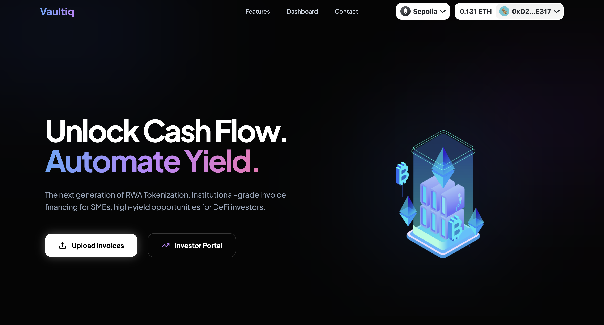
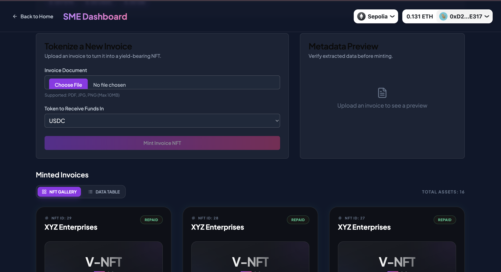
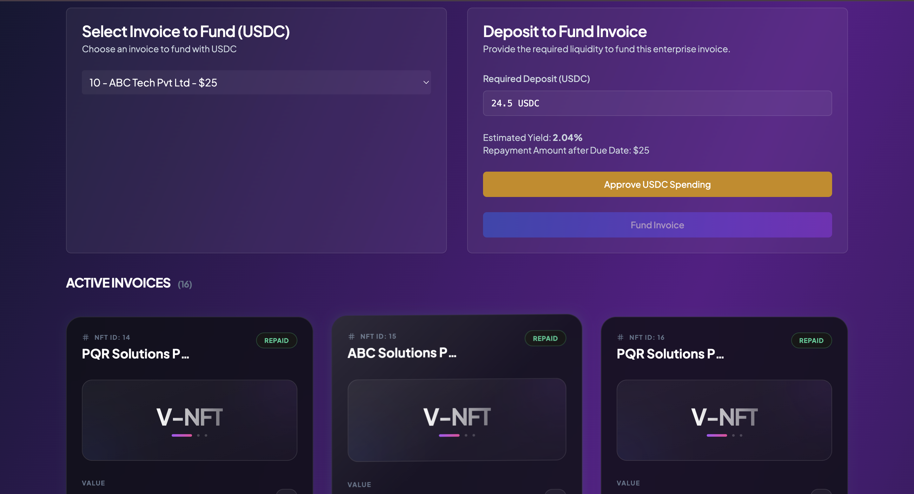

# Vaultiq – Decentralized RWA Invoice Financing

Vaultiq is a next-generation Web3 protocol designed to bridge the gap between Real-World Assets (RWA) and decentralized liquidity. By leveraging AI-powered OCR and blockchain technology, Vaultiq enables Small and Medium Enterprises (SMEs) to transform their unpaid invoices into liquid, on-chain assets.

---

## 🧠 The Problem
Traditional invoice factoring is slow, opaque, and expensive. SMEs often wait 30–90 days for payments, creating critical gaps in working capital. Small businesses are frequently underserved by traditional financial institutions, leaving them with limited options for immediate liquidity.

---

## 🚀 The Solution: Automated NFT Generation
Vaultiq provides a seamless pipeline for **Automated NFT Generation**. Using an advanced AI OCR engine, the protocol extracts verified metadata (amount, due date, counterparty) from uploaded invoice PDFs and mints them as unique **ERC-721 NFTs** on the Sepolia testnet.

These NFTs represent a digital claim on future cash flows, allowing:
*   **SMEs** to unlock instant working capital by tokenizing their outstanding debt.
*   **Investors** to fund verified invoices using any crypto asset, earning high-fidelity yield backed by real economic activity.

---

## 🔁 How It Works

1.  **Invoice Upload**: SME uploads a PDF invoice through the portal.
2.  **AI OCR Parsing**: The backend OCR service extracts invoice fields like amount, due date, and customer name using Tesseract.
3.  **NFT Minting**: The verified invoice data is minted as an ERC-721 token on the Sepolia testnet, with metadata securely stored on **IPFS**.
4.  **Investor Funding**: Investors browse the marketplace, review invoice details, and choose to fund them using supported tokens.
5.  **Repayment & Settlement**: Once the SME repays the invoice, the funds are settled to the investor, and the NFT status is updated on-chain.

---

## 🖼️ Demo Screenshots

**1. Landing Page**    


**2. SME Dashboard**  
*Upload invoices, extract metadata, and generate NFTs.*  


**3. Investor Marketplace**  
*Browse verified invoice NFTs and provide liquidity.*  


---

## 🧱 Technical Architecture

```plaintext
Frontend (Next.js + Wagmi + RainbowKit)
        |
FastAPI OCR Service (AI Tesseract Engine)
        |
Backend APIs (Node.js + PostgreSQL)
        |
Smart Contracts (Solidity + Sepolia Testnet)
        |
Decentralized Storage (Pinata / IPFS)
```

### 🛠️ Tech Stack
*   **Frontend**: Next.js, Tailwind CSS, Lucide React
*   **Web3**: Wagmi, Viem, RainbowKit, Ethers.js
*   **Backend**: Node.js, Express, FastAPI (Python)
*   **AI/OCR**: Tesseract OCR
*   **Database**: PostgreSQL
*   **Blockchain**: Solidity, Hardhat (Sepolia Testnet)
